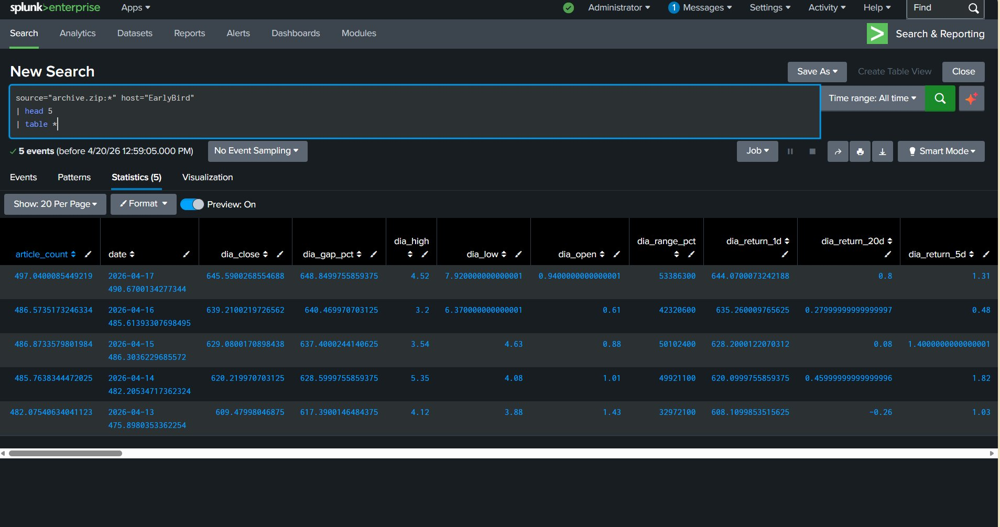
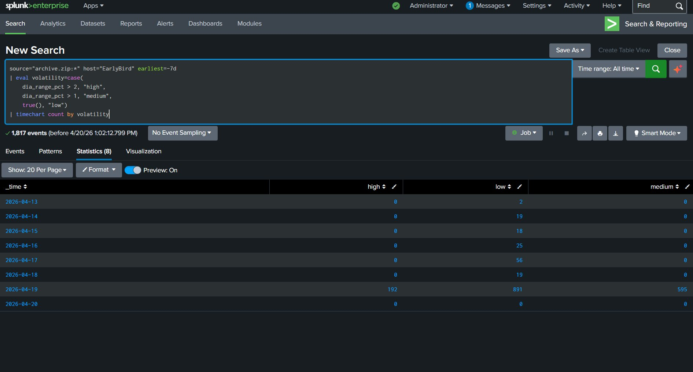
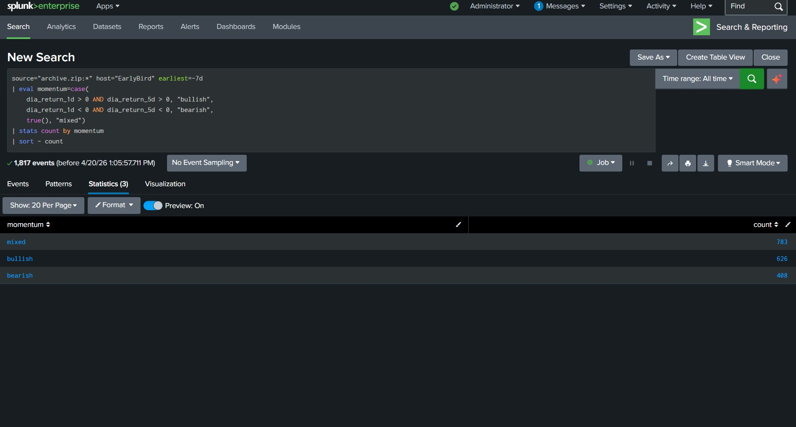
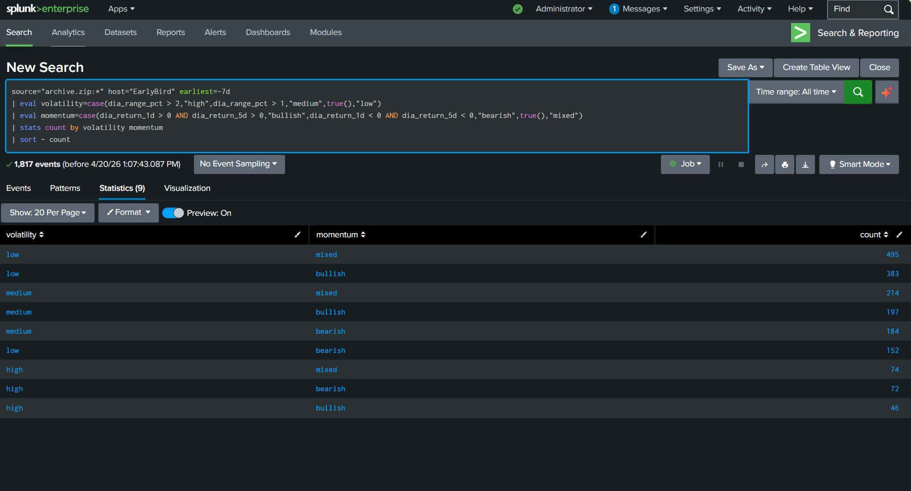

# 🔍 Splunk Market Sentiment Analysis Lab


---

## 📋 Overview

This is my first Splunk home lab project. The goal was to ingest a stock market sentiment dataset and use SPL (Splunk Processing Language) to analyze market behavior through a series of progressively complex searches. Each search builds on the last to tell a cohesive story about market volatility, momentum, and sentiment.

| Detail | Value |
|---|---|
| **Tool** | Splunk Enterprise |
| **Dataset** | Market Sentiment (EarlyBird) |
| **Source** | `archive.zip:*` |
| **Host** | `EarlyBird` |
| **Time Range** | Last 7 Days (`earliest=-7d`) |
| **Total Events** | 1,817 |

---

## 🎯 Objectives

- Practice writing SPL searches of increasing complexity
- Use `eval`, `case`, `timechart`, `stats`, and `sort` commands
- Derive meaningful insights from raw stock market data
- Build toward a multi-panel Splunk dashboard

---

## 📊 Dataset Fields

Key fields discovered during initial data exploration:



| Field | Description |
|---|---|
| `date` | Date of the record |
| `article_count` | Number of news articles for that day |
| `dia_close` | Closing price |
| `dia_open` | Opening price |
| `dia_high` | Daily high price |
| `dia_low` | Daily low price |
| `dia_range_pct` | Daily price range as a percentage |
| `dia_return_1d` | 1-day return percentage |
| `dia_return_5d` | 5-day return percentage |
| `dia_return_20d` | 20-day return percentage |

---

## 🔎 Search 1 — Ticker Activity Over Time

**Objective:** Establish a baseline by visualizing how often ticker events appear over the last 7 days.

```spl
source="archive.zip:*" host="EarlyBird" earliest=-7d
| timechart count by ticker
| head 10
```

### Commands Used

| Command | Purpose |
|---|---|
| `timechart` | Buckets events into time intervals and counts per ticker |
| `head 10` | Returns the first 10 time buckets |

> **Key Finding:** Provided a baseline view of when market data events were most frequent across the 7-day window. This search established the foundation for all subsequent analysis.

---

## 📈 Search 2 — Volatility Classification

**Objective:** Use `eval` and `case` to classify each event into a volatility tier based on the daily price range percentage.

```spl
source="archive.zip:*" host="EarlyBird" earliest=-7d
| eval volatility=case(
    dia_range_pct > 2, "high",
    dia_range_pct > 1, "medium",
    true(), "low")
| timechart count by volatility
```

### Commands Used

| Command | Purpose |
|---|---|
| `eval` | Creates a new derived field called volatility |
| `case` | Conditional logic to classify each event as high, medium, or low |
| `timechart` | Shows how volatility levels changed day by day |



> **Key Finding:** Most days showed predominantly low volatility. April 19th was a significant outlier with 192 high, 595 medium, and 891 low volatility events — a clear anomaly worth investigating.

---

## 🎯 Search 3 — Momentum Analysis

**Objective:** Determine the directional momentum of the market by combining 1-day and 5-day returns.

```spl
source="archive.zip:*" host="EarlyBird" earliest=-7d
| eval momentum=case(
    dia_return_1d > 0 AND dia_return_5d > 0, "bullish",
    dia_return_1d < 0 AND dia_return_5d < 0, "bearish",
    true(), "mixed")
| stats count by momentum
| sort - count
```

### Commands Used

| Command | Purpose |
|---|---|
| `eval` + `AND` | Multi-condition logic combining 1d and 5d returns |
| `stats count by` | Aggregates total count per momentum category |
| `sort - count` | Orders results from highest to lowest |



| Momentum | Count |
|---|---|
| Mixed | 783 |
| Bullish | 626 |
| Bearish | 408 |

> **Key Finding:** The market leaned slightly positive overall with bullish events (626) outpacing bearish ones (408). Mixed momentum was most common, suggesting the market lacked strong directional conviction.

---

## 🔬 Search 4 — Volatility vs Momentum (Combined Analysis)

**Objective:** Combine both derived fields into a single search to understand how volatility and momentum interact.

```spl
source="archive.zip:*" host="EarlyBird" earliest=-7d
| eval volatility=case(dia_range_pct > 2,"high",dia_range_pct > 1,"medium",true(),"low")
| eval momentum=case(dia_return_1d > 0 AND dia_return_5d > 0,"bullish",dia_return_1d < 0 AND dia_return_5d < 0,"bearish",true(),"mixed")
| stats count by volatility momentum
| sort - count
```

### Commands Used

| Command | Purpose |
|---|---|
| Multiple `eval` | Runs both volatility and momentum transformations in one search |
| `stats count by` | Groups results by combination of both fields |
| `sort - count` | Orders by most frequent combinations first |



| Volatility | Momentum | Count |
|---|---|---|
| Low | Mixed | 495 |
| Low | Bullish | 383 |
| Medium | Mixed | 214 |
| Medium | Bullish | 197 |
| Medium | Bearish | 184 |
| Low | Bearish | 152 |
| High | Mixed | 74 |
| High | Bearish | 72 |
| High | Bullish | 46 |

> **Key Finding:** The most common market condition was low volatility + mixed momentum (495), confirming a generally calm but directionless market. High volatility + bullish was the rarest combination at only 46 occurrences, showing that explosive upward moves are uncommon.

---

## 📚 SPL Commands Learned

| Command | Purpose |
|---|---|
| `timechart` | Aggregate data into time buckets for trend visualization |
| `eval` | Create new derived fields using expressions |
| `case` | Conditional logic inside eval (like if/else) |
| `stats` | Aggregate and summarize data |
| `sort` | Order results ascending or descending |
| `head` | Limit number of returned rows |
| `AND` | Combine multiple conditions in eval logic |

---

## 💡 Key Takeaways

- The dataset covers stock market activity with price and return metrics across multiple tickers
- April 19th showed a significant volatility spike that stood out across all searches
- The market was predominantly low volatility and mixed/bullish over the 7-day window
- Using `eval` to derive new fields from raw numeric data is a powerful pattern for enriching datasets before analysis
- `timechart` is best for trend analysis over time; `stats` is best for aggregate summaries
- Chaining multiple `eval` statements in one search enables cross-dimensional analysis

---

## 🚀 What I Plan to Build Next

- Save these searches as **reports** in Splunk
- Build a **dashboard** combining all four searches into panels
- Explore **Splunk alerting** by setting a threshold on high volatility events
- Rebuild this lab independently from scratch to reinforce the concepts
- Explore correlation searches using these derived fields

---

## Author

**Nick Walker**  
Splunk Core Certified Power User  
*First Splunk Home Lab Project — April 2026*
